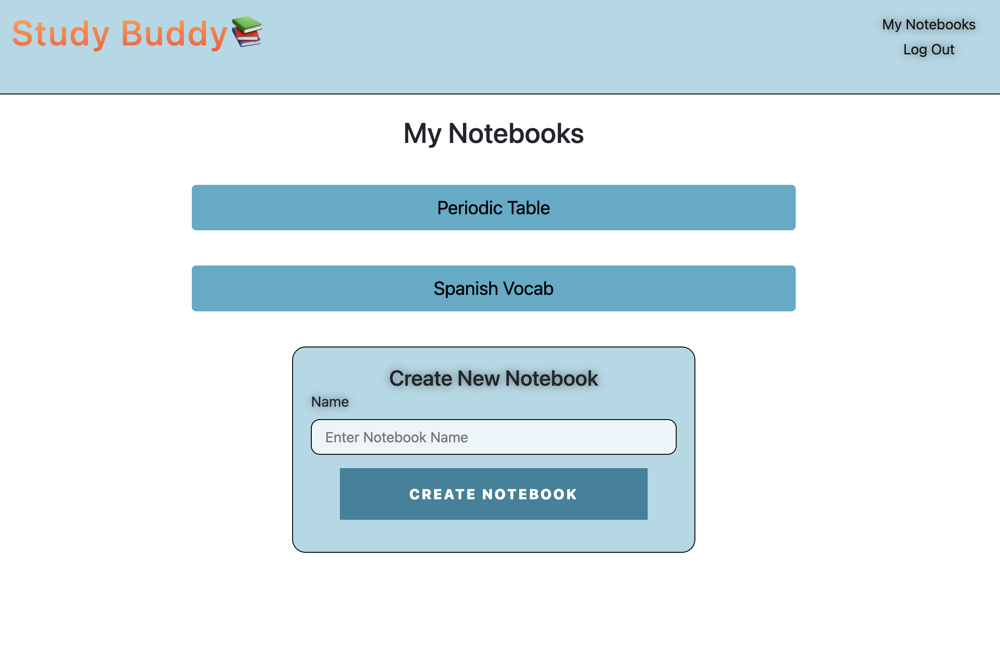
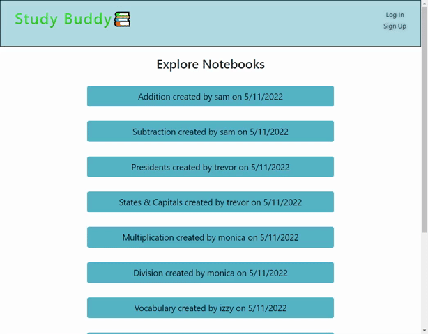
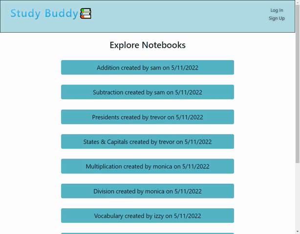

# Study Buddy

## Table-of-Contents

- [Description](#description)
- [Deployed Site](#deployed-site)
- [Features](#features)
- [Technologies](#technologies)
- [Future Development](#future-development)
- [Credits](#credits)

## Description

### You'll never lose your notes again!

Tired of taking notes with paper and pencil, only to misplace them? Study Buddy offers a cloud-based storage system for all of your note-taking needs! You can add, update, or delete your notes on this online platform. Even after you log out of your computer for the evening, your notes will still be waiting for you when you return to your computer. Plus, you can view other user's notes too!

Study Buddy is a site that allows users to create, read, save, delete, and share personalized notes. This application follows the MVC paradigm in its architectural structure, using Handlebars.js as the templating language, Sequelize as the ORM, and the express-session npm package for authentication.

## Deployed Site

Follow [this link](https://afternoon-refuge-77491.herokuapp.com/) to view and use our site!

## Features

This is how Study Buddy appears to users. The page is responsive, adapting to multiple screen sizes.

When visiting Study Buddy, users are presented with a homepage. On this homepage, they can view notebooks created by other users. They can then view the contents of each notebook by clicking on them. Users are only able to edit their own notebooks - not the notebooks of other users.

If the user wishes to create their own notebooks, they must have an account. Users can sign up by clicking the link in the top right-hand corner. Alternatively, users can log in if they already have an account. Upon signing in, users are brought to their notebooks.

Users can create a new notebook by entering a title and submitting the form. Once the notebook has been created, users can add, edit, or delete notes from their notebook. By clicking on the note within the notebook, users can edit or delete that note from their notebook. If the user wishes to delete their entire notebook, they can do that by clicking the red "delete notebook" at the bottom of the screen.

## Technologies

- HTML
- CSS
- JavaScript
- Node.js
- Express.js
- MySQL2
- Sequelize.js
- npm
- [dotenv](https://www.npmjs.com/package/dotenv)
- [bcrypt](https://www.npmjs.com/package/bcrypt)
- [Handlebars.js](https://handlebarsjs.com/)
- Heroku

## Future Development

In the future, I would like to add the following improvements:

- A profile page for users that shows their information and notebooks.
- A "favorite" system where you can save your favorite or most-used notebooks for easy access.
- An organizational sorting system to file your notebooks into folders.
- A search function where a user can query a keyword and search notebooks for that term. This function could be expanded to a filtering system where users can also filter by a notebook type.
- The ability to make a notebook private or public, giving the user freedom to hide certain notebooks from other's view.

We're always interested in refactoring code to improve it's functionality. If you would like to suggest your own improvements, you can reach our development team at the links below.

## Credits

### Contributors

| **Ashley Smith**                                    | **Kelsey Alderman**                                                 | **Mohamed Abdullahi**                                            |
| --------------------------------------------------- | ------------------------------------------------------------------- | ---------------------------------------------------------------- |
| - [Github](https://github.com/ashlynn4567)          | - [Github](https://github.com/kelseyalderman)                       | - [Github](https://github.com/mo9399)                            |
| - [LinkedIn](www.linkedin.com/in/Ashley-Lynn-Smith) | - [LinkedIn](https://www.linkedin.com/in/kelsey-alderman-79019922b) | - [LinkedIn](http://linkedin.com/in/mohamed-abdullahi-944b2922b) |

### Acknowledgements

This project was built with the help of the University of Oregon's Coding Boot Camp.

## Licensing

The application is covered under the following license: [MIT](https://opensource.org/licenses/MIT)
