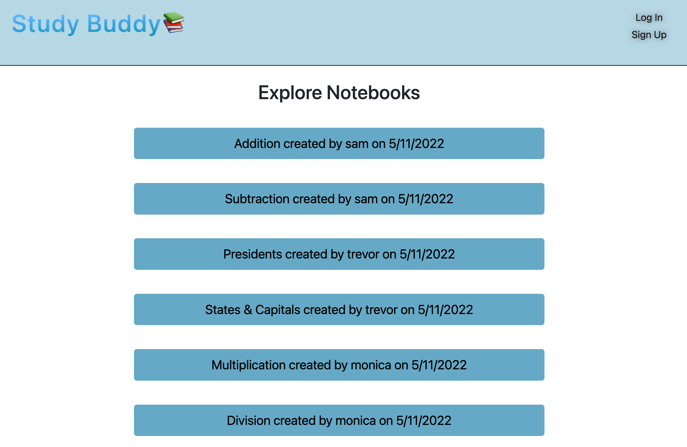
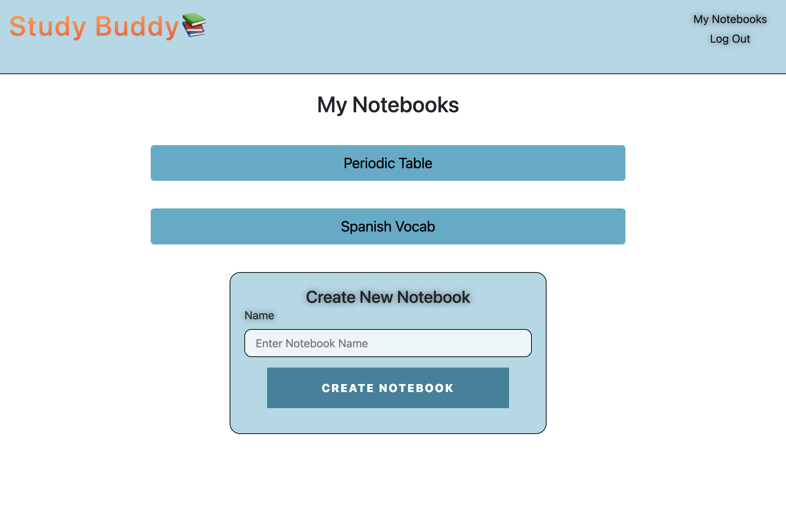
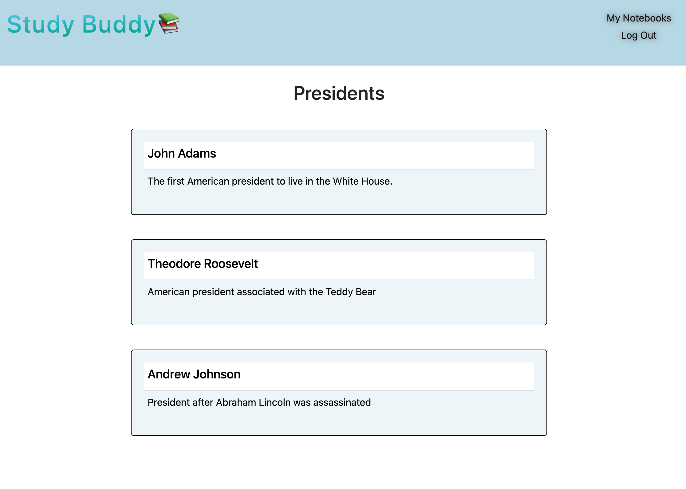

# Study Buddy

## Description

A site that allows users to create, save, and share personalized notes. The app follows the MVC paradigm in its architectural structure, using Handlebars.js as the templating language, Sequelize as the ORM, and the express-session npm package for authentication.

## Usage and Features

This is Study Buddy appears to users. The page is responsive, adapting to multiple screen sizes.

## Built With

- [JavaScript](https://developer.mozilla.org/en-US/docs/Web/JavaScript)
- [CSS](https://developer.mozilla.org/en-US/docs/Web/CSS)
- [Node.js](https://nodejs.org/en/)
- [Express.js](https://www.npmjs.com/package/express)
- [mySQL2](https://www.npmjs.com/package/mysql2)
- [Sequelize.js](https://sequelize.org/)
- [dotenv](https://www.npmjs.com/package/dotenv)
- [bcrypt](https://www.npmjs.com/package/bcrypt)
- [Handlebars.js](https://handlebarsjs.com/)
- [Heroku](https://www.heroku.com/)

## Deployed Site

Follow this [link](https://afternoon-refuge-77491.herokuapp.com/) to view and use our site! 

## Suggestion Box

In the future, I would like to add the following improvements:

- A profile page for users that shows their information and notebooks.
- A "favorite" system where you can save your favorite or most-used notebooks for easy access.
- An organizational sorting system to file your notebooks into folders.
- A search function where a user can query a keyword and search notebooks for that term. This function could be expanded to a filtering system where users can also filter by a notebook type.
- The ability to make a notebook private or public, giving the user freedom to hide certain notebooks from other's view. 

We're always interested in refactoring code to improve it's functionality. If you would like to suggest your own improvements, you can reach our development team at the links below.

## Credits

### Contributors

| **Ashley Smith**                                    | **Kelsey Alderman**                                                 | **Mohamed Abdullahi**                                            |
| --------------------------------------------------- | ------------------------------------------------------------------- | ---------------------------------------------------------------- |
| - [Github](https://github.com/ashlynn4567)          | - [Github](https://github.com/kelseyalderman)                       | - [Github](https://github.com/mo9399)                            |
| - [LinkedIn](www.linkedin.com/in/Ashley-Lynn-Smith) | - [LinkedIn](https://www.linkedin.com/in/kelsey-alderman-79019922b) | - [LinkedIn](http://linkedin.com/in/mohamed-abdullahi-944b2922b) |

### Acknowledgements

This project was built with the help of the University of Oregon's Coding Boot Camp.
